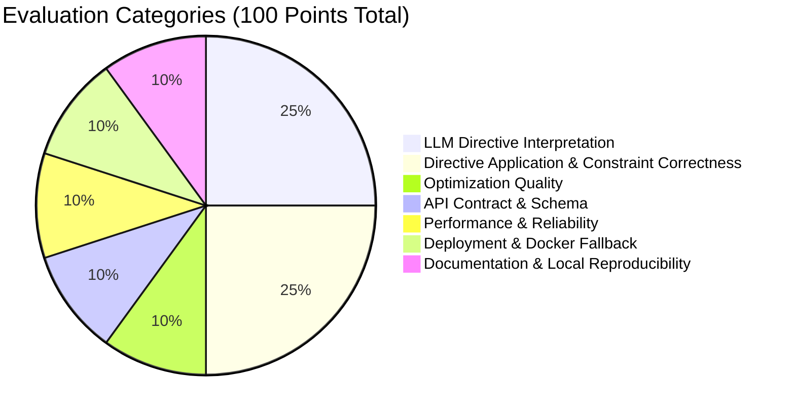
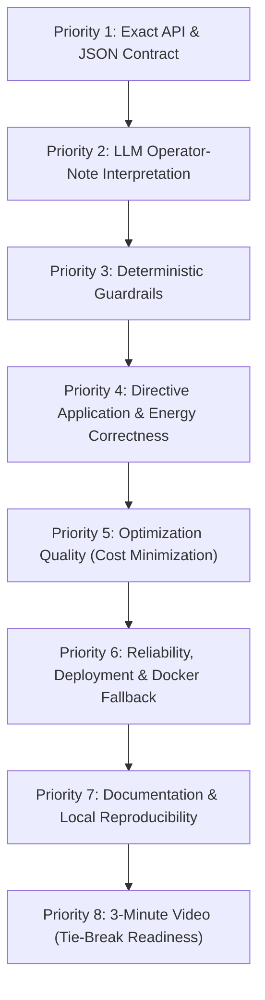

# Bangladesh University of Professionals (BUP)
**Department of Computer Science & Engineering (CSE)**  
**BUP CSE FEST 2026 HACKATHON**  
*In association with Poridhi (poridhi.io)*  
Mirpur Cantonment, Dhaka – 1216

---

# Participant Guide & Evaluation Rubric
## Smart Campus Energy Optimization Challenge (GridWise)
### Online Preliminary Round

| Item | Details |
| :--- | :--- |
| **Round** | Online Preliminary |
| **Round Window** | 7:00 PM – 11:00 PM (4 hours) |
| **Required Service** | Deployed Public HTTP API |
| **Health Endpoint** | `GET /health` |
| **Primary Endpoint** | `POST /optimize-energy` |
| **LLM Requirement** | Mandatory for `operator_notes` interpretation |

> [!IMPORTANT]
> **PURPOSE**: Use this guide for participation, deployment, submission, and evaluation rules. The separate **Problem Statement** defines the GridWise challenge behavior, operator-note directives, schemas, and optimization rules.

---

## Table of Contents

- [01. About This Guide & Document Pack](#01-about-this-guide--document-pack)
- [02. Required Deliverables](#02-required-deliverables)
  - [2.1 Deliverables Overview](#21-deliverables-overview)
  - [2.2 Submission Package](#22-submission-package)
- [03. Technical & Deployment Rules](#03-technical--deployment-rules)
  - [3.1 Required Judge Access](#31-required-judge-access)
  - [3.2 Deployment & Reproducibility Rules](#32-deployment--reproducibility-rules)
- [04. LLM, Technology, Security & Repository Policy](#04-llm-technology-security--repository-policy)
  - [4.1 Implementation Policy](#41-implementation-policy)
  - [4.2 Security & Repository Requirements](#42-security--repository-requirements)
- [05. Testing & Submission Checklist](#05-testing--submission-checklist)
- [06. Evaluation Model](#06-evaluation-model)
  - [6.1 Seven Scoring Categories Breakdown](#61-seven-scoring-categories-breakdown)
- [07. Scoring Rubric](#07-scoring-rubric)
  - [7.1 Detailed Criteria](#71-detailed-criteria)
  - [7.2 Optimization Score Formula](#72-optimization-score-formula)
- [08. LLM & API Quality Metrics](#08-llm--api-quality-metrics)
- [09. Critical Violations & Penalties](#09-critical-violations--penalties)
- [10. Hidden Tests & Tie-Breakers](#10-hidden-tests--tie-breakers)
  - [10.1 Hidden Tests Policy](#101-hidden-tests-policy)
  - [10.2 Tie-Break Priority Order](#102-tie-break-priority-order)
- [11. Final Quick Reference](#11-final-quick-reference)
  - [11.1 Recommended Implementation Priority](#111-recommended-implementation-priority)
  - [11.2 Final Pre-Submit Checklist](#112-final-pre-submit-checklist)

---

## 01. About This Guide & Document Pack

This document explains how to participate, deploy, submit, and understand the evaluation for the LLM-assisted GridWise preliminary. It does not redefine the challenge itself.

The online preliminary round runs from **7:00 PM to 11:00 PM (4 hours)**.

> [!WARNING]
> **IMPORTANT**: For `operator_notes`, supported directive types, structured adjustments, guardrails, request/response fields, battery rules, and exact challenge behavior, read the separate **Problem Statement**.

### Participant Document Pack

| Document | Purpose |
| :--- | :--- |
| **Problem Statement** | Defines the scenario, operator-note interpretation, supported directives, API schema, optimization rules, guardrails, and required outputs. |
| **Participant Guide & Evaluation Rubric (this document)** | Defines execution, deployment, repository policy, submission, scoring, penalties, and tie-break rules. |
| **Public Sample Cases JSON** | Provides worked input/output examples for local validation. Public cases are references, not the hidden judge set. |

### Inside This Guide

| Section | Contents |
| :--- | :--- |
| **02** | Required Deliverables |
| **03** | Technical & Deployment Rules |
| **04** | LLM, Technology, Security & Repository Policy |
| **05** | Testing & Submission Checklist |
| **06** | Evaluation Model |
| **07** | Scoring Rubric |
| **08** | LLM & API Quality Metrics |
| **09** | Critical Violations & Penalties |
| **10** | Hidden Tests & Tie-Breakers |
| **11** | Final Quick Reference |

---

## 02. Required Deliverables

Submit one complete solution that the judging harness can evaluate without asking your team for setup help.

### 2.1 Deliverables Overview

| Required Item | Requirement | Notes |
| :--- | :--- | :--- |
| **API service** | Deploy one HTTP API service exposing both required endpoints. | Submit one unified service, not separate deployments. |
| `GET /health` | Readiness endpoint for the judging harness. | Must return HTTP 200 with `{"status": "ok"}` as defined in the Problem Statement. |
| `POST /optimize-energy` | Main LLM interpretation + 24-hour optimization endpoint. | Must follow the exact request/response contract in the Problem Statement. |
| `directive_interpretation` | Return exactly one machine-checkable interpretation entry for every operator note, in `note_index` order. | Applicable notes use `applies = true`. Irrelevant notes use `applies = false`, `directive_type = "no_op"`, and `structured_adjustment = null`. |
| `hourly_plan` | Return the final 24-hour schedule after applying all valid directives. | The judge independently replays and verifies the schedule. |
| **Source repository** | Provide all source code, dependency specifications, and configuration files. | Repository timing and visibility must strictly follow the official rulebook. |
| `README.md` | Provide an excellent, self-contained `README.md` that lets organizers run and test the solution locally without team assistance. | Include source setup, environment-variable names, model/provider, LLM role, guardrails, optimizer/solver, exact run command, health/API curl examples, public-sample test command, dependencies, and known limitations. **Do not include secret values.** |
| **Docker fallback image** | Submit a tested container image as a fallback execution path for organizers. | Provide a pullable registry reference with an exact tag or digest. The image must expose the documented service port, bind to `0.0.0.0`, and must **not** contain baked-in secrets. |
| **3-minute solution video** | Submit a maximum 3-minute video explaining the problem, architecture overview, and your solution approach. | Focus on technical clarity: problem understanding, LLM-to-guardrail-to-optimizer architecture, key implementation choices, and how the solution is run/tested. Production-quality editing is not required. |

### 2.2 Submission Package

| Item # | Required Submission | What to Provide |
| :---: | :--- | :--- |
| **1** | **Working public endpoint** | Base URL reachable by the judge for `GET /health` and `POST /optimize-energy`. |
| **2** | **GitHub repository** | Repository created after question reveal; keep private during the event and make public after the submission deadline for evaluation. |
| **3** | **README & configuration** | Setup/run instructions, model/provider or local model identifier, required environment-variable names, solver/library usage, and sample request/response. |
| **4** | **Docker fallback image** *(Public API URL Recommended)* | Registry image reference (Docker Hub, GHCR, or equivalent) with exact tag/digest, required environment-variable names, exposed port, and one verified `docker run` command. Image must remain pullable during evaluation. |
| **5** | **3-minute architecture / solution video** | MP4 upload or organizer-accessible link. Maximum 3 minutes. Explain the problem, architecture overview, and solution flow; show enough implementation detail for judges to understand how the LLM, guardrails, and optimizer work together. |

---

## 03. Technical & Deployment Rules

Keep the judging path exact, reachable, reproducible, and practical for repeated LLM-assisted hidden tests.

### 3.1 Required Judge Access

- The judge must be able to call `GET /health` and `POST /optimize-energy` from the submitted base URL.
- **No authentication barrier**: No login, dashboard access, manual approval, API keys required on judge calls, VPN, or private-network access may be required for the judging endpoint.
- The service must accept JSON and return JSON using the exact endpoint names and fields defined in the Problem Statement.
- The submitted service must remain reachable throughout the evaluation window, including during repeated LLM-backed requests.
- **Pre-flight verification**: Test both endpoints from outside your local development environment before submitting.

### 3.2 Deployment & Reproducibility Rules

| Rule | Requirement |
| :--- | :--- |
| **Platform choice** | Teams may deploy on any reachable platform (e.g. AWS, GCP, Render, Railway, Fly.io, VPS, etc.). Judging is based on behavior, accessibility, and reproducibility, not provider choice. |
| **LLM availability** | The language model used for `operator_notes` must remain available during judging. Teams are responsible for keys, quota, rate limits, and provider availability. |
| **Runtime training** | Do not require long training or fine-tuning jobs during evaluation. |
| **Deterministic validation** | LLM output must pass the exact deterministic guardrails in the Problem Statement before it is applied to the optimizer, including directive type, note mapping, hours, applies semantics, and numeric ranges. |
| **Local reproduction** | The `README.md` must provide a copy-paste local quickstart from a clean environment: clone/pull, configure environment variables, install dependencies or pull image, start service, call `/health`, and run at least one public sample against `/optimize-energy`. |

> [!NOTE]
> **CANONICAL CONTRACT**: If this guide and the Problem Statement appear to disagree about operator-note directives, schemas, guardrails, battery behavior, or optimization validity, the **Problem Statement is the canonical source**.

---

## 04. LLM, Technology, Security & Repository Policy

LLM use for `operator_notes` is mandatory. Other implementation choices are open as long as the submitted system is valid, secure, reproducible, and compliant with the Problem Statement.

### 4.1 Implementation Policy

| Approach | Policy | Compliance Status |
| :--- | :--- | :---: |
| **Language-capable generative model** | Required for interpreting `operator_notes`. Its structured interpretation must be part of the path that produces the optimization constraints. | **MANDATORY** |
| **Deterministic preprocessing / postprocessing** | Allowed for normalization, JSON validation, guardrails, and applying structured directives. It may not replace the required language-model interpretation step. | **ALLOWED** |
| **Optimization libraries / solvers** | Allowed, including linear programming (LP/MIP), dynamic programming, constraint solving, or other practical optimization methods (e.g., PuLP, SciPy, OR-Tools, CVXPY). | **ALLOWED** |
| **External model API or local model** | Allowed. Teams may choose the provider/model (e.g. Gemini, OpenAI, Claude, Groq, Ollama, local vLLM), but must meet reliability and latency requirements and document the model/provider used. | **ALLOWED** |
| **Hard-coded phrase matching as the sole interpreter** | Not compliant. Hidden notes may paraphrase the same directive, and the language model must be part of the interpretation path. | **NON-COMPLIANT** |
| **AI used only for `plan_summary` or documentation** | Does not satisfy the LLM requirement. The model must interpret `operator_notes` into `directive_interpretation` used by the optimizer. | **NON-COMPLIANT** |

### 4.2 Security & Repository Requirements

- **No Secrets**: Do not commit API keys, tokens, `.env` files, passwords, or other secrets to the repository.
- **No Leaks**: Do not expose secrets, tokens, raw prompts containing secrets, stack traces, or sensitive values in logs or API responses.
- **Synthetic Data**: Use only the synthetic challenge data supplied by the harness; do not use live campus, utility, billing, or personal data.
- **Repository Timing**: Create a new GitHub repository after the question is revealed and develop the round solution there. Keep it private during the event and make it public after the submission deadline for evaluation.
- **Original Work & Credits**: AI coding assistants and public libraries/frameworks/APIs/SDKs are permitted under the official rulebook, but core architecture and logic should be the team's own work. Credit all external tools and dependencies in `README.md`.

> [!CAUTION]
> **EXTERNAL MODEL RESPONSIBILITY**: If your solution depends on a hosted model/API, your team is responsible for valid credentials, quota, cost, rate limits, and availability. Judges are not expected to repair an unavailable dependency. A local or backup model is allowed if it still satisfies the Problem Statement.

---

## 05. Testing & Submission Checklist

Run these checks before submitting. They combine operator-note interpretation, guardrails, directive application, optimization, deployment, and repository requirements.

| Check | What to Verify |
| :--- | :--- |
| **API** | `/health` responds with 200 `{"status":"ok"}`; `/optimize-energy` accepts the exact request schema and returns the exact response schema. |
| **LLM interpretation** | Every operator note produces exactly one `directive_interpretation` entry in `note_index` order with `applies`, `directive_type`, `structured_adjustment`, and `explanation`. |
| **Guardrails & directives** | Only supported directive types are emitted; `no_op` uses `applies = false` and `null` adjustment; all other directives use `applies = true`; hours are unique integers 0–23 in ascending order; numeric values are valid; relevant directives are applied before optimization. |
| **Optimization** | The 24-hour plan is valid first, then minimizes recalculated grid electricity cost after all organizer-ground-truth directives are applied. |
| **Energy constraints** | Demand, effective solar, battery bounds, rate limits, state transitions, directive-specific limits, and end-of-day neutrality are all respected. |
| **Robustness** | Malformed JSON, invalid structured input, LLM/provider errors, repeated requests, and unexpected valid numeric combinations do not crash the service. |
| **Deployment** | Both endpoints work from outside the development environment and remain reachable during evaluation. |
| **Submission package** | Endpoint, public-after-deadline repository, excellent README/local quickstart, model/provider, environment-variable names, optimizer/solver, credited libraries, sample request/response, fallback Docker image, and 3-minute video are included. |
| **Local reproduction** | From a clean machine/environment, follow the `README.md` exactly and verify that the service starts, `/health` returns `{"status":"ok"}`, and at least one Public Sample Cases request succeeds without undocumented steps. |
| **3-minute video** | Video is accessible to judges, is no longer than 3 minutes, and clearly explains the problem, architecture overview, solution approach, LLM/guardrail/optimizer flow, and how the system is executed/tested. |
| **Repository access** | Follow the official rulebook: create a new repository after question reveal, keep it private during the event, and make it public after the submission deadline for evaluation. |
| **Final secret check** | Do not submit secret values in public fields, Git history, or `README.md`. |

---

## 06. Evaluation Model

The preliminary uses **automated testing as the primary evaluation mechanism** (100 base points).

- **Primary Evaluation (100 Points)**: Automated judge tests score core API behavior, LLM directive interpretation, directive application, optimization quality, schema correctness, performance, and reliability. Deployment/Docker and documentation are checked against fixed reproducibility criteria.
- **Video Tie-Break Review (No Base Points)**: The 3-minute architecture/solution video is reviewed **only** when two or more teams finish with the same total score and a tie must be resolved, especially at a qualification or ranking boundary. Reviewers compare problem understanding, architecture clarity, the LLM $\to$ deterministic guardrails $\to$ optimizer flow, and run/testing explanation.

### 6.1 Seven Scoring Categories Breakdown

| # | Category | Max Points | Evaluation Method |
| :-: | :--- | :-: | :--- |
| **1** | **LLM Directive Interpretation** | 25 | Automated Tests |
| **2** | **Directive Application & Constraint Correctness** | 25 | Automated Tests |
| **3** | **Optimization Quality** | 10 | Automated Tests |
| **4** | **API Contract & Schema** | 10 | Automated Tests |
| **5** | **Performance & Reliability** | 10 | Automated Tests |
| **6** | **Deployment & Docker Fallback** | 10 | Automated + Artifact Check |
| **7** | **Documentation & Local Reproducibility** | 10 | Structured Reproducibility Check |
| **TOTAL** | | **100** | |

> [!IMPORTANT]
> **LLM interpretation and downstream application are scored separately.** Correct extraction is not enough if the returned schedule does not obey the directive. Optimization credit is considered only after the affected hidden case is valid under organizer ground-truth directives and normal GridWise rules. The 3-minute video carries no base marks and is used only to resolve tied total scores.

---

## 07. Scoring Rubric

### 7.1 Detailed Criteria

| Category / Score / Stage | Detailed Point Breakdown & What It Measures |
| :--- | :--- |
| **LLM Directive Interpretation** *(25 pts · Automated)* | **25 Points Total**: • **5 pts**: Relevance / `no_op` classification accuracy. • **5 pts**: `directive_type` identification. • **5 pts**: Correct affected `hours` array extraction. • **5 pts**: Numeric values extraction and required `structured_adjustment` shape. • **5 pts**: Paraphrase robustness across related hidden notes. *(Free-text explanation wording is not matched byte-for-byte.)* |
| **Directive Application & Constraint Correctness** *(25 pts · Automated)* | **25 Points Total**: • **10 pts**: Organizer ground-truth directive application to schedule. • **5 pts**: Hourly energy balance & effective-solar validity. • **5 pts**: Battery transitions, capacity bounds, and hourly charge/discharge rate limits. • **5 pts**: Action consistency (`idle` requires `battery_kwh = 0`), end-of-day battery neutrality, and non-negative values. |
| **Optimization Quality** *(10 pts · Automated)* | **10 Points Total**: Cost-quality score over optimization hidden cases. Invalid cases receive **zero** optimization credit. Valid cases are scored from organizer optimal cost versus recalculated team cost (see formula below). |
| **API Contract & Schema** *(10 pts · Automated)* | **10 Points Total**: • **2 pts**: Endpoints (`/health`, `/optimize-energy`) and HTTP status behavior. • **2 pts**: Request validation and controlled error codes. • **3 pts**: `directive_interpretation` schema, ordering, and data types. • **3 pts**: `hourly_plan` schema, top-level response fields, and `scenario_id` echo. |
| **Performance & Reliability** *(10 pts · Automated)* | **10 Points Total**: • **2 pts**: Health readiness within 60s of start. • **3 pts**: p95 latency thresholds ($p95 \le 5\text{s}$). • **3 pts**: Valid-request stability and low failure rate. • **2 pts**: Controlled handling of malformed input / model provider failures, and secret safety. |
| **Deployment & Docker Fallback** *(10 pts · Automated + Artifact Check)* | **10 Points Total**: • **3 pts**: Live endpoint reachability during judging. • **4 pts**: Working pullable Docker fallback image that reaches `/health` using the documented command. • **2 pts**: Clean startup/reproducibility from submitted instructions. • **1 pt**: No judge debugging or manual code changes required. |
| **Documentation & Local Reproducibility** *(10 pts · Structured Reproducibility Check)* | **10 Points Total**: • **3 pts**: Clean local quickstart from a fresh environment. • **2 pts**: Environment, configuration, and model-provider documentation. • **2 pts**: Public-sample test procedure and expected result matching. • **1 pt**: LLM / guardrail / optimizer architecture explanation. • **1 pt**: Docker pull and run fallback instructions. • **1 pt**: Dependencies, limitations, and secret-handling guidance. |

### 7.2 Optimization Score Formula

For each valid optimization hidden case:

$$\text{quality\_ratio} = \min\left(1, \frac{\text{organizer\_optimal\_cost}}{\text{recalculated\_team\_cost}}\right)$$

$$\text{Optimization Quality Score} = 10 \times \text{average}(\text{quality\_ratio})$$

#### Edge Cases:
- If both $\text{organizer\_optimal\_cost}$ and $\text{recalculated\_team\_cost}$ are within numeric tolerance ($0.01\text{ BDT}$) of $0$:
  $$\text{quality\_ratio} = 1$$
- If $\text{organizer\_optimal\_cost}$ is within tolerance of $0$, but team cost is above tolerance:
  $$\text{quality\_ratio} = 0$$

> [!NOTE]
> **SCORING PRINCIPLE**: The system is judged as a pipeline: understand the note $\to$ validate the structured directive $\to$ apply it to the optimization $\to$ return a valid schedule $\to$ optimize cost. A cheap schedule built on a wrong or ignored directive does not score as a correct solution.

---

## 08. LLM & API Quality Metrics

These machine-checkable interpretation, operational, and API thresholds are used by the judge harness and reproducibility checks:

| Metric | Expected Standard | Meaning |
| :--- | :--- | :--- |
| **Interpretation coverage** | Exactly one `directive_interpretation` entry for every `operator_notes` item, returned in `note_index` order `0..N-1`. | Missing, duplicate, or out-of-order mappings are schema/interpretation failures. |
| **Directive accuracy** | `applies`, `directive_type`, required `structured_adjustment` shape, `hours`, and numeric values must match organizer ground truth within tolerance. | `no_op` must use `applies = false` and `null` adjustment; every other directive must use `applies = true`. |
| **Paraphrase robustness** | Equivalent hidden phrasings of the same rule should resolve to the same underlying directive. Whole-hour convention applied. | Measured across related hidden test cases. |
| **Downstream application** | The final `hourly_plan` must satisfy every applicable organizer-ground-truth directive (`solar_reduction`, `minimum_battery_reserve`, `no_charge_window`, `no_discharge_window`, `max_grid_window`). | Correct extraction without correct scheduling is insufficient. |
| **Health readiness** | `GET /health` returns `{"status":"ok"}` within 60 seconds of service start. | Demonstrates readiness before hidden tests execute. |
| **Per-request timeout** | `POST /optimize-energy` must complete within 30 seconds. | Responses beyond 30s are treated as failures. |
| **p95 latency** | • $p95 \le 5\text{s}$: **3/3 pts** • $5\text{s} < p95 \le 15\text{s}$: **2/3 pts** • $15\text{s} < p95 \le 30\text{s}$: **1/3 pts** • $> 30\text{s}$: **0/3 pts** (timed-out requests fail) | Repeated LLM/API slowness reduces the Performance score. |
| **Failure rate** | Valid requests should not return 5xx, invalid JSON, or drop connection. | Service must remain stable across repeated calls. |
| **Malformed input** | Return a controlled error (e.g. 400 Bad Request); do not crash or invent unsupported directives. | Bad input or unexpected LLM responses must not crash the daemon. |
| **Secret handling** | No API keys, tokens, raw secret values, or sensitive stack traces in repo, logs, or responses. | Never leak credentials or sensitive config. |
| **Time & factor normalization** | `hours` must be unique integers 0–23 in ascending order. 1 PM to 3 PM maps to `[13, 14]`. For `solar_reduction`, factor is usable fraction remaining (80% drop $\to 0.2$). | Makes hidden semantic extraction strictly machine-checkable. |
| **Numeric tolerance** | Use absolute tolerance of **0.01 kWh** or **0.01 BDT** unless the official judge package specifies a stricter value. | Matches canonical floating-point tolerance. |
| **Documentation & local reproducibility** | README is self-contained; judges can run the service locally from clean environment with documented env vars, test `/health`, and run a sample case. | Scored via fixed reproducibility criteria. |
| **Docker fallback image** | Submitted image can be pulled, run with documented command, and reaches `/health`. No baked-in credentials. | Fallback execution path for automated verification. |
| **3-minute video** | Accessible, $\le 3\text{ minutes}$, clear problem understanding, architecture flow, and testing explanation. | Tie-break only (no base points). |

---

## 09. Critical Violations & Penalties

A low-cost schedule is not acceptable if it misunderstands or violates an applicable operator directive, or if it breaks the underlying GridWise energy rules.

| Violation | Penalty | Explanation |
| :--- | :--- | :--- |
| **Required LLM absent from operator-note interpretation path, or AI used only for `plan_summary`/documentation** | **Fails mandatory challenge requirement; ineligible for final preliminary shortlist.** | Automated and artifact verification may inspect repository/architecture to confirm that a language-capable generative model directly produces the structured interpretation used by the optimizer. |
| **Relevant note interpreted incorrectly or marked `no_op`** | **Interpretation credit lost for affected note/case.** | Judge compares structured interpretation against organizer ground truth. Schedule is still checked against the true directive. |
| **Applicable ground-truth directive not reflected in `hourly_plan`** | **Affected hidden case invalid for directive application; ZERO optimization credit for that case.** | Judge replays the plan using the true hidden directive, not only team-reported interpretation. |
| **Energy-balance failure or unmet hourly demand** | **Affected hidden case treated as invalid; ZERO optimization credit.** | Every hour must satisfy $\text{grid} + \text{solar\_used} + \text{discharge} = \text{demand} + \text{charge}$. |
| **Battery bound, transition, charge-rate, or discharge-rate violation** | **Affected hidden case treated as invalid; ZERO optimization credit.** | Judge independently replays battery state hour by hour. |
| **Effective-solar overuse or impossible/negative energy values** | **Affected hidden case treated as invalid; ZERO optimization credit.** | `solar_reduction` changes available solar before schedule is checked. |
| **`no_charge_window`, `no_discharge_window`, minimum reserve, or `max_grid_window` violation** | **Affected hidden case treated as invalid; ZERO optimization credit.** | Applicable directive constraints are hard operational rules. |
| **End-of-day battery energy does not return to initial level** | **Affected hidden case treated as invalid; ZERO optimization credit.** | Battery neutrality prevents using starting energy as a free one-time source. |
| **Reported totals disagree with `hourly_plan` or repeated critical invalidity** | **Recalculation / scoring deduction; repeated failures may block qualification eligibility.** | `hourly_plan` is the canonical source of truth for totals and validity. |

> [!CAUTION]
> **GROUND TRUTH BEFORE COST**: The judge first checks the organizer ground-truth directive, its downstream application, and normal GridWise constraints. Only then is optimization quality scored for that hidden case.

---

## 10. Hidden Tests & Tie-Breakers

Public examples teach the contract. Hidden tests determine whether the full LLM-to-optimizer pipeline generalizes across unseen language and energy conditions.

### 10.1 Hidden Tests Policy

- The exact hidden case list, wording, distribution, and expected answers will not be published.
- Each valid hidden scenario follows the Problem Statement and contains 1–3 synthetic operator notes mapping to supported directive types or `no_op`.
- The same underlying directive may be paraphrased with different wording, whole-hour time expressions, percentages, or equivalent numeric descriptions. **Do not hard-code public phrases.**
- Hidden cases vary demand, solar, tariff, battery state, reserve/rate limits, and directive combinations.
- Organizer valid scoring scenarios are feasible and do not require mutually contradictory hard directives.
- Equivalent valid optimal schedules are accepted; evaluation is based on interpretation ground truth, directive application, validity, and recalculated cost.

### 10.2 Tie-Break Priority Order

If two or more teams finish with the same total base score, ties are resolved in the following strict order:

| Priority | Tie-Breaker | Why It Matters |
| :---: | :--- | :--- |
| **1** | **3-minute Architecture & Solution Video** | Reviewers compare problem understanding, architecture clarity, LLM $\to$ guardrail $\to$ optimizer pipeline flow, and testing explanation. |
| **2** | **Directive Application & Constraint Correctness** | Stronger correctness against ground-truth directives and GridWise constraints ranks higher. |
| **3** | **LLM Directive Interpretation** | Better semantic extraction across paraphrased notes separates genuine language understanding. |
| **4** | **Optimization Quality** | Stronger cost quality among valid solutions separates teams. |
| **5** | **API / Schema Validity** | Exact machine-checkable contracts make evaluation reliable. |
| **6** | **Reliability and Deployment Stability** | Pipeline remains reachable and responsive under load. |
| **7** | **Documentation & Local Reproducibility** | Clear copy-paste setup, public-sample validation, and Docker fallback. |
| **8** | **Exceptional Engineering / Verification** | Robust guardrails, fallbacks, caching, testing, and clean codebase. |

---

## 11. Final Quick Reference

### 11.1 Recommended Implementation Priority

### 11.2 Final Pre-Submit Checklist

- [ ] `GET /health` is reachable and returns `{"status":"ok"}`.
- [ ] `POST /optimize-energy` is reachable externally and accepts 1–3 `operator_notes` with the exact Problem Statement schema.
- [ ] Every operator note produces exactly one `directive_interpretation` entry in `note_index` order; `no_op` uses `applies = false` + `structured_adjustment = null`, and all other directives use `applies = true` with the exact required `structured_adjustment` shape.
- [ ] LLM output is deterministically guardrailed before optimization: directive hours are unique integers 0–23 in ascending order, numeric values are valid, and invalid model output cannot silently invent constraints or crash.
- [ ] `hourly_plan` obeys organizer ground-truth directives plus energy balance, effective-solar, battery capacity, rate-limit, grid-cap, and end-of-day neutrality rules.
- [ ] `total_grid_kwh`, `total_cost_bdt`, and `peak_grid_kwh` match values recalculated from `hourly_plan`.
- [ ] `README.md` is self-contained with clean local quickstart: setup, required environment variable names, model/provider or local model, LLM role, guardrails, optimizer/solver, dependencies, exact run command, `/health` test, `/optimize-energy` curl/sample test, known limitations, and **no committed secrets**.
- [ ] GitHub repository was created after question reveal, remains private during the event, is made public after the deadline, the submitted endpoint remains reachable for evaluation, and all fallback/video links remain accessible through judging.
- [ ] Fallback Docker image is submitted with an exact pullable tag/digest: documented `docker pull` and `docker run` commands work, `/health` becomes ready, documented port is exposed, and no secrets are baked into the image.
- [ ] Required 3-minute video is accessible and explains the problem, architecture overview, solution approach, LLM $\to$ deterministic guardrails $\to$ optimizer pipeline, and how organizers can run/test the submission.
