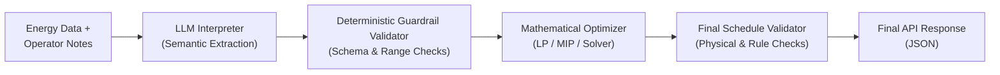

# Bangladesh University of Professionals (BUP)
**Department of Computer Science & Engineering (CSE)**  
**BUP CSE FEST 2026 HACKATHON**  
*In association with Poridhi (poridhi.io)*  
Mirpur Cantonment, Dhaka – 1216

---

# Preliminary Problem Statement: Smart Campus Energy Optimization Challenge
## LLM-Assisted Operator Directive Interpretation
### Online Preliminary Round

| Item | Details |
| :--- | :--- |
| **Round** | Online Preliminary |
| **Round Window** | 7:00 PM – 11:00 PM (4 hours) |
| **Challenge Type** | LLM-assisted energy scheduling and optimization |
| **Required Service** | Deployed Public HTTP API |
| **Health Endpoint** | `GET /health` |
| **Main Endpoint** | `POST /optimize-energy` |
| **Planning Horizon** | 24 hourly intervals (hours 0 through 23) |
| **Operator Notes** | 1–3 natural-language notes per scenario |
| **Response Format** | Structured JSON |

> [!NOTE]
> All scenarios and operator notes are synthetic. No live campus, utility, billing, or personal data is required.

---

## Table of Contents

- [00. How to Use This Statement](#00-how-to-use-this-statement)
- [01. The Scenario](#01-the-scenario)
- [02. What You Are Building](#02-what-you-are-building)
- [03. End-to-End Processing Flow](#03-end-to-end-processing-flow)
- [04. Operator Notes & Supported Directives](#04-operator-notes--supported-directives)
  - [4.1 Supported Directive Types](#41-supported-directive-types)
  - [4.2 Simple Examples](#42-simple-examples)
- [05. Clauses & Optimization Task](#05-clauses--optimization-task)
  - [5.1 Operator-Note Clauses](#51-operator-note-clauses)
  - [5.2 Optimization Objective](#52-optimization-objective)
  - [5.3 How Directives Change the Math](#53-how-directives-change-the-math)
- [06. API Contract](#06-api-contract)
  - [6.1 HTTP Response Codes](#61-http-response-codes)
  - [6.2 Health Response](#62-health-response)
- [07. Request Schema](#07-request-schema)
  - [7.1 Top-Level Fields](#71-top-level-fields)
  - [7.2 Hour Entry](#72-hour-entry)
  - [7.3 Battery Object](#73-battery-object)
  - [7.4 Example Request Shape](#74-example-request-shape)
- [08. LLM Interpretation Guardrails](#08-llm-interpretation-guardrails)
- [09. Battery & Energy Rules](#09-battery--energy-rules)
  - [9.1 Battery State](#91-battery-state)
  - [9.2 Battery Bounds](#92-battery-bounds)
  - [9.3 Hourly Charge/Discharge Limits](#93-hourly-chargedischarge-limits)
  - [9.4 Solar Usage](#94-solar-usage)
  - [9.5 Energy Balance](#95-energy-balance)
  - [9.6 End-of-Day Battery Neutrality](#96-end-of-day-battery-neutrality)
- [10. Response Schema](#10-response-schema)
  - [10.1 Top-Level Response Fields](#101-top-level-response-fields)
  - [10.2 Directive Interpretation Entry](#102-directive-interpretation-entry)
  - [10.3 Hourly Plan Entry](#103-hourly-plan-entry)
  - [10.4 Example Interpretation Fragment](#104-example-interpretation-fragment)
- [11. Exact Validation & Hidden Evaluation](#11-exact-validation--hidden-evaluation)
  - [11.1 Interpretation Checks](#111-interpretation-checks)
  - [11.2 Downstream Application Checks](#112-downstream-application-checks)
  - [11.3 Existing GridWise Consistency Checks](#113-existing-gridwise-consistency-checks)
  - [11.4 Hidden Language Variation](#114-hidden-language-variation)
  - [11.5 Numeric Tolerance](#115-numeric-tolerance)
- [12. Canonical Specification Note](#12-canonical-specification-note)

---

## 00. How to Use This Statement

This document is the **canonical specification** for the preliminary challenge behavior, API contract, operator-note interpretation, optimization rules, and validation requirements.

> [!IMPORTANT]
> Deployment, repository, submission, performance, scoring, tie-break, and general participation rules remain defined in the separate **Participant Guide & Evaluation Rubric**.

### Participant Document Pack

| Document | Purpose |
| :--- | :--- |
| **Problem Statement (this document)** | Defines the scenario, operator-note interpretation, API schema, optimization rules, and validity requirements. |
| **Participant Guide & Evaluation Rubric** | Defines deployment, testing, submission, scoring, penalties, and tie-break rules. |
| **Public Sample Cases JSON** | Provides worked scenarios for local validation. Public cases are references, not the hidden judge set. |

### Inside This Statement

| Section | Contents |
| :--- | :--- |
| **01–03** | Scenario, system goal, and end-to-end flow |
| **04–05** | Operator directives, clauses, and optimization objective |
| **06–07** | API contract and request schema |
| **08** | LLM interpretation guardrails |
| **09** | Battery and energy-accounting rules |
| **10** | Response schema |
| **11** | Exact validation and hidden evaluation |
| **12** | Canonical specification note |

---

## 01. The Scenario

BUP is operating a smart campus using electricity purchased from the grid, rooftop solar generation, and a battery energy storage system. Campus demand, solar availability, and grid tariff vary throughout the day. The next 24 hours of demand, solar generation, and grid tariff are already provided. In addition, campus operators may send short natural-language notes describing temporary operating conditions that affect the same 24-hour schedule.

Your service must:
1. Understand the notes.
2. Convert relevant instructions into structured directives.
3. Apply those directives to the optimization problem.
4. Return a valid, low-cost operating plan.

---

## 02. What You Are Building

Build **one HTTP API service** that receives a 24-hour energy scenario plus operator notes, and returns both a machine-checkable interpretation of those notes and the final 24-hour energy schedule.

- **Interpret every operator note** using an LLM or other language-capable generative model.
- **Convert relevant notes** into one of the supported directive types.
- **Mark irrelevant notes as `no_op`** instead of inventing an energy rule.
- **Validate the interpreted directives** deterministically before sending them to the optimizer.
- **Produce a valid schedule** that satisfies the normal GridWise rules and every applicable directive.
- **Minimize total grid electricity cost** after correctness is satisfied.

> [!CAUTION]
> **LLM REQUIREMENT**: The language model must be part of the operator-note interpretation path. Using an LLM only for `plan_summary`, documentation, or cosmetic text does **not** satisfy this requirement.

---

## 03. End-to-End Processing Flow

The LLM understands human language; deterministic code validates the interpretation; the optimizer performs the mathematical scheduling.



> **CORE IDEA**: Human notes are not directly trusted as math. They are first converted to a fixed structured format, checked by deterministic guardrails, and only then applied to the optimization model.

---

## 04. Operator Notes & Supported Directives

Each scenario contains **1–3 operator notes**. Some notes affect the current schedule; others are realistic distractors and must be ignored. Hidden cases may express the same directive using different wording.

### 4.1 Supported Directive Types

| Directive Type | Meaning | Required `structured_adjustment` Shape |
| :--- | :--- | :--- |
| `solar_reduction` | Reduce usable solar during specific hours. | `{"hours": [int, ...], "factor": number}` |
| `minimum_battery_reserve` | Keep battery energy at or above a required level. | `{"hours": [int, ...], "minimum_energy_kwh": number}` |
| `no_charge_window` | Battery charging is unavailable during specific hours. | `{"hours": [int, ...]}` |
| `no_discharge_window` | Battery discharging is unavailable during specific hours. | `{"hours": [int, ...]}` |
| `max_grid_window` | Grid import may not exceed a stated amount during specific hours. | `{"hours": [int, ...], "max_grid_kwh": number}` |
| `no_op` | The note does not affect the current 24-hour energy schedule. | `null` |

### 4.2 Simple Examples

| Operator Note | Expected Interpretation |
| :--- | :--- |
| *"Solar output will drop to about 20% from 1 PM to 3 PM."* | `solar_reduction`; `hours: [13, 14]`; `factor: 0.2` |
| *"Do not charge the battery between 2 PM and 4 PM."* | `no_charge_window`; `hours: [14, 15]` |
| *"Keep at least 120 kWh in reserve from 6 PM until 9 PM."* | `minimum_battery_reserve`; `hours: [18, 19, 20]`; `minimum_energy_kwh: 120` |
| *"The cafeteria menu changes tomorrow."* | `no_op`; `applies: false`; `structured_adjustment: null` |

---

## 05. Clauses & Optimization Task

### 5.1 Operator-Note Clauses

1. **Exact 1-to-1 Mapping**: Every operator note must produce exactly one `directive_interpretation` entry. Entries must be returned in `note_index` order: `0, 1, ... N-1`.
2. **Supported Directives Only**: Only the 6 directive types listed in Section 04 are accepted.
3. **Relevance Application**: Relevant notes must be applied to the optimization before scheduling.
4. **Irrelevant Notes**: Irrelevant notes must use `applies = false`, `directive_type = "no_op"`, and `structured_adjustment = null`.
5. **Paraphrase Invariance**: The same directive may appear in different wording in hidden test cases.
6. **Time Window Convention**: Time windows use whole-hour intervals. The start hour is included and the end hour is excluded:
   - *1 PM to 3 PM* means hours `[13, 14]`.
7. **No Invention / Hallucination**: The LLM must not invent demand, solar, tariff, battery limits, or unsupported directive types.
8. **Application Requirement**: A schedule that interprets a note correctly but does not apply it to the optimization is still incorrect.
9. **`applies` Semantics**: For every non-`no_op` directive, `applies` must be `true`. `no_op` is the only directive allowed with `applies = false`.
10. **Hours Ordering & Range**: Every `hours` array inside `structured_adjustment` must contain unique integers from `0` through `23` in ascending order.
11. **Solar Factor Semantics**: For `solar_reduction`, `factor` means the usable fraction that remains.
    - *Example*: An 80% reduction means `factor = 0.2`.
12. **Feasibility Guarantee**: Organizer valid scoring scenarios are feasible and will not require mutually contradictory hard directives to be satisfied at the same time.

### 5.2 Optimization Objective

After applying all valid directive adjustments, minimize the total cost of grid electricity over the 24-hour horizon:

$$\text{total\_cost\_bdt} = \sum_{h=0}^{23} \left( \text{grid\_kwh}[h] \times \text{tariff\_bdt\_per\_kwh}[h] \right)$$

> [!IMPORTANT]
> Lower cost is better, but a low-cost schedule is **invalid** if it breaks any energy, battery, or operator-directive rule.

### 5.3 How Directives Change the Math

| Directive | Deterministic Effect Used by Optimizer |
| :--- | :--- |
| `solar_reduction` | $\text{effective\_solar}[h] = \text{original\_solar}[h] \times \text{factor}$ for each listed hour. |
| `minimum_battery_reserve` | $\text{battery\_energy\_after\_kwh}[h] \ge \max(\text{base minimum\_energy\_kwh}, \text{directive minimum\_energy\_kwh})$ for each listed hour. |
| `no_charge_window` | Battery charge amount $= 0$ in the listed hours (`battery_action` cannot be `charge`). |
| `no_discharge_window` | Battery discharge amount $= 0$ in the listed hours (`battery_action` cannot be `discharge`). |
| `max_grid_window` | $\text{grid\_kwh}[h] \le \text{max\_grid\_kwh}$ in the listed hours. |
| `no_op` | No change to the optimization model. |

---

## 06. API Contract

The judge harness exercises only the endpoints below. Endpoint names must match exactly.

| Endpoint | Method | Requirement |
| :--- | :--- | :--- |
| `/health` | `GET` | Return HTTP 200 with a JSON object containing `status: "ok"` when the service is ready. |
| `/optimize-energy` | `POST` | Accept one scenario JSON object and return one interpretation + optimization-plan JSON object. |

### 6.1 HTTP Response Codes

| Code | Meaning |
| :--- | :--- |
| `200` | Successful health response or successful optimization response. |
| `400` | Malformed JSON or structurally invalid request. |
| `422` | *(Optional)* Semantically invalid but well-formed request. |
| `500` | Controlled internal error. Do not expose secrets or raw stack traces. |

### 6.2 Health Response

```json
{
  "status": "ok"
}
```

---

## 07. Request Schema

`POST /optimize-energy` accepts one JSON object.
- The `hours` array must contain exactly 24 entries for hours 0 through 23.
- `operator_notes` must contain 1–3 non-empty natural-language strings, each referring to the same 24-hour scenario.

### 7.1 Top-Level Fields

| Field | Type | Requirement |
| :--- | :--- | :--- |
| `scenario_id` | `string` | Unique synthetic scenario identifier. |
| `operator_notes` | `array[1..3] of string` | Natural-language campus operator notes to interpret. |
| `hours` | `array[24]` | Hourly demand, solar availability, and grid tariff. |
| `battery` | `object` | Battery capacity, starting energy, reserve, and hourly limits. |

### 7.2 Hour Entry

| Field | Type | Meaning |
| :--- | :--- | :--- |
| `hour` | `integer` | Unique integer from 0 to 23. |
| `demand_kwh` | `number` | Campus demand that must be supplied in this hour. |
| `solar_kwh` | `number` | Base solar energy available before operator-note adjustments. |
| `tariff_bdt_per_kwh` | `number` | Grid electricity price for this hour. |

### 7.3 Battery Object

| Field | Type | Meaning |
| :--- | :--- | :--- |
| `capacity_kwh` | `number` | Maximum energy the battery can store. |
| `initial_energy_kwh` | `number` | Battery energy at the start of hour 0. |
| `minimum_energy_kwh` | `number` | Base reserve level the battery must never go below. |
| `max_charge_kwh_per_hour` | `number` | Maximum energy that may be added in one hour. |
| `max_discharge_kwh_per_hour` | `number` | Maximum energy that may be removed in one hour. |

### 7.4 Example Request Shape

```json
{
  "scenario_id": "GRID-101",
  "operator_notes": [
    "Solar output will drop to about 20% from 1 PM to 3 PM.",
    "Do not charge the battery between 2 PM and 4 PM.",
    "The cafeteria menu changes tomorrow."
  ],
  "hours": [
    {
      "hour": 0,
      "demand_kwh": 180,
      "solar_kwh": 0,
      "tariff_bdt_per_kwh": 7
    },
    "... 22 more hourly entries ...",
    {
      "hour": 23,
      "demand_kwh": 200,
      "solar_kwh": 0,
      "tariff_bdt_per_kwh": 9
    }
  ],
  "battery": {
    "capacity_kwh": 500,
    "initial_energy_kwh": 200,
    "minimum_energy_kwh": 50,
    "max_charge_kwh_per_hour": 100,
    "max_discharge_kwh_per_hour": 100
  }
}
```

---

## 08. LLM Interpretation Guardrails

LLM output must be treated as untrusted structured data until deterministic validation passes.

| Guardrail | Requirement |
| :--- | :--- |
| **Allowed types** | `directive_type` must be one of the values in Section 04 (`solar_reduction`, `minimum_battery_reserve`, `no_charge_window`, `no_discharge_window`, `max_grid_window`, `no_op`). |
| **Note mapping** | `note_index` must identify an existing operator note (0-indexed) and each note must appear exactly once. |
| **Hours** | Every listed hour must be a unique integer from 0 through 23, returned in ascending order. |
| **Solar factor** | For `solar_reduction`, `factor` must be a number between 0 and 1 inclusive ($0 \le \text{factor} \le 1$). |
| **Battery reserve** | Reserve values must be finite, non-negative, and not exceed battery `capacity_kwh`. |
| **Grid cap** | `max_grid_kwh` must be finite and non-negative. |
| **No invention** | The interpretation may not change base demand, tariff, or battery parameters unless a supported directive explicitly allows it. |
| **Final replay** | The completed schedule is replayed after optimization to verify every extracted directive was actually followed. |
| **`applies` semantics** | For `no_op`: `applies = false` and `structured_adjustment = null`.<br>For every other directive: `applies = true` and `structured_adjustment` must match the required shape in Section 04. |
| **Feasible judge scenarios** | Valid organizer scoring scenarios will have a feasible ground-truth interpretation and will not require contradictory hard directives. |

> [!WARNING]
> **SAFE FAILURE**: If the LLM returns malformed or unsupported structured output, the service must handle it in a controlled way. The service must not silently invent a new directive type or crash.

---

## 09. Battery & Energy Rules

The existing GridWise energy rules remain unchanged. The judge independently replays the final schedule hour by hour using the effective solar and any additional operator directives.

### 9.1 Battery State

At hour $h$, given energy state before the hour $E_{\text{before}}$ and battery action:
- **`charge`**: $E_{\text{after}} = E_{\text{before}} + \text{battery\_kwh}$
- **`discharge`**: $E_{\text{after}} = E_{\text{before}} - \text{battery\_kwh}$
- **`idle`**: $E_{\text{after}} = E_{\text{before}}$ and $\text{battery\_kwh} = 0$

*(For hour 0, $E_{\text{before}} = \text{initial\_energy\_kwh}$. For hour $h > 0$, $E_{\text{before}}[h] = E_{\text{after}}[h-1]$.)*

### 9.2 Battery Bounds

For every hour $h \in [0, 23]$:
$$\text{minimum\_energy\_kwh} \le E_{\text{after}} \le \text{capacity\_kwh}$$

If an active `minimum_battery_reserve` directive applies to hour $h$:
$$E_{\text{after}}[h] \ge \max(\text{base minimum\_energy\_kwh}, \text{directive minimum\_energy\_kwh})$$

### 9.3 Hourly Charge/Discharge Limits

- If `battery_action` is `charge`:
  $$\text{battery\_kwh} \le \text{max\_charge\_kwh\_per\_hour}$$
- If `battery_action` is `discharge`:
  $$\text{battery\_kwh} \le \text{max\_discharge\_kwh\_per\_hour}$$

### 9.4 Solar Usage

For each hour $h$:
$$0 \le \text{solar\_used\_kwh}[h] \le \text{effective\_solar\_kwh}[h]$$

Unused solar is curtailed. **Grid export is not part of this challenge.**

### 9.5 Energy Balance

In every hour $h$, power supply must equal power consumption:
$$\text{grid\_kwh} + \text{solar\_used\_kwh} + \text{battery\_discharge\_kwh} = \text{demand\_kwh} + \text{battery\_charge\_kwh}$$

*(Note: If `battery_action` is `charge`, $\text{battery\_discharge\_kwh} = 0$. If `battery_action` is `discharge`, $\text{battery\_charge\_kwh} = 0$. If `idle`, both are 0.)*

### 9.6 End-of-Day Battery Neutrality

At the end of hour 23:
$$\text{final battery\_energy\_after\_kwh}[23] = \text{initial\_energy\_kwh}$$

> **WHY THIS RULE EXISTS**: The starting battery may shift energy between hours, but it cannot be consumed as a free one-time source by ending the day at a lower state of charge.

---

## 10. Response Schema

A successful `POST /optimize-energy` response must include both the operator-note interpretation and the final 24-hour schedule.

### 10.1 Top-Level Response Fields

| Field | Type | Requirement |
| :--- | :--- | :--- |
| `scenario_id` | `string` | Must match the request `scenario_id`. |
| `directive_interpretation` | `array` | One machine-checkable interpretation entry for every operator note. |
| `hourly_plan` | `array[24]` | One plan entry for every hour 0 through 23. |
| `total_grid_kwh` | `number` | Sum of `grid_kwh` across all 24 hours. |
| `total_cost_bdt` | `number` | Calculated total grid electricity cost. |
| `peak_grid_kwh` | `number` | Maximum hourly `grid_kwh` in the returned plan. |
| `plan_summary` | `string` | Short human-readable explanation of the final strategy. |

### 10.2 Directive Interpretation Entry

| Field | Type | Requirement |
| :--- | :--- | :--- |
| `note_index` | `integer` | Zero-based index of the corresponding `operator_notes` entry. |
| `applies` | `boolean` | `true` for every applicable non-`no_op` directive; `false` only for `no_op`. |
| `directive_type` | `string` | One supported directive type from Section 04. `no_op` is required when `applies = false`. |
| `structured_adjustment` | `object` \| `null` | Exact machine-checkable object required by Section 04, or `null` only for `no_op`. |
| `explanation` | `string` | Short explanation of the interpretation. |

### 10.3 Hourly Plan Entry

| Field | Type | Allowed Value / Meaning |
| :--- | :--- | :--- |
| `hour` | `integer` | Integer 0 through 23. |
| `grid_kwh` | `number` | Non-negative grid energy purchased in this hour ($\ge 0$). |
| `solar_used_kwh` | `number` | Solar energy used in this hour; cannot exceed effective solar. |
| `battery_action` | `string` | Exactly one of: `"charge"`, `"discharge"`, `"idle"`. |
| `battery_kwh` | `number` | Non-negative magnitude of the battery action. Must be `0` when `idle`. |
| `battery_energy_after_kwh` | `number` | Battery energy immediately after completing this hour. |

### 10.4 Example Interpretation Fragment

```json
{
  "directive_interpretation": [
    {
      "note_index": 0,
      "applies": true,
      "directive_type": "solar_reduction",
      "structured_adjustment": {
        "hours": [13, 14],
        "factor": 0.2
      },
      "explanation": "Solar availability is reduced during panel cleaning."
    },
    {
      "note_index": 1,
      "applies": false,
      "directive_type": "no_op",
      "structured_adjustment": null,
      "explanation": "This note does not affect today's energy schedule."
    }
  ]
}
```

---

## 11. Exact Validation & Hidden Evaluation

Hidden evaluation checks both language understanding and energy optimization. Teams should not assume that only `total_cost_bdt` or the free-text explanation is checked.

### 11.1 Interpretation Checks
- Correctly identify whether each note applies or is `no_op`.
- Return the correct directive type.
- Extract the correct hours and numeric values within the allowed tolerance.
- Remain robust when the same directive is paraphrased in different ways.
- Return one entry per note in `note_index` order, with no missing or duplicate mappings.
- Match the required `structured_adjustment` shape for the selected directive type.
- Use `applies = false` only for `no_op`; all applicable directives use `applies = true`.

### 11.2 Downstream Application Checks
- The judge recomputes effective solar after `solar_reduction` directives.
- The judge verifies reserve, no-charge, no-discharge, and grid-cap directives directly against `hourly_plan`.
- **Correct extraction without correct downstream application does not pass the case.**

### 11.3 Existing GridWise Consistency Checks
- `hourly_plan` contains exactly 24 unique hours, 0 through 23.
- Required numeric values are finite and non-negative.
- Battery transitions, capacity, minimum energy, and hourly rate limits are valid.
- Solar usage never exceeds effective available solar.
- The energy-balance equation holds every hour.
- Final battery energy equals initial battery energy.
- `total_grid_kwh`, `total_cost_bdt`, and `peak_grid_kwh` match values recalculated from `hourly_plan`.

### 11.4 Hidden Language Variation

The same underlying rule may be written differently in hidden cases. For example, all three notes below mean the same solar-reduction directive:

> - *"PV production will drop to about 20% between 13:00 and 15:00."*
> - *"Panel washing from one until three will leave roughly one-fifth of normal solar output."*
> - *"Expect an 80% reduction in rooftop solar during the 1-3 PM maintenance window."*

All map to:
```json
{
  "applies": true,
  "directive_type": "solar_reduction",
  "structured_adjustment": {
    "hours": [13, 14],
    "factor": 0.2
  }
}
```

Hidden scoring notes will map to exactly one supported directive type or `no_op`. They may be paraphrased, but they will not require an unpublished directive type or an impossible combination of hard constraints.

> **NO BYTE-FOR-BYTE MATCHING**: Equivalent valid optimal schedules may differ. The judge evaluates structured interpretation, directive application, schedule validity, and recalculated cost rather than exact JSON equality with one reference plan.

### 11.5 Numeric Tolerance

For normal floating-point arithmetic, judge calculations should treat values within an absolute tolerance of **0.01 kWh** or **0.01 BDT** as equivalent unless the official judge package specifies a stricter value.

---

## 12. Canonical Specification Note

For this challenge, this **Problem Statement** is the canonical source for endpoint names, request/response fields, operator-note directive types, interpretation guardrails, battery behavior, energy accounting, and optimization validity rules.

The separate **Participant Guide & Evaluation Rubric** remains canonical for deployment, repository policy, submission procedure, performance requirements, evaluation weights, penalties, and tie-breakers.

> [!TIP]
> **FINAL REMINDER**: Understand the operator notes first. Validate the extracted directives. Apply them to the optimization. Then produce a valid 24-hour schedule and minimize cost.
